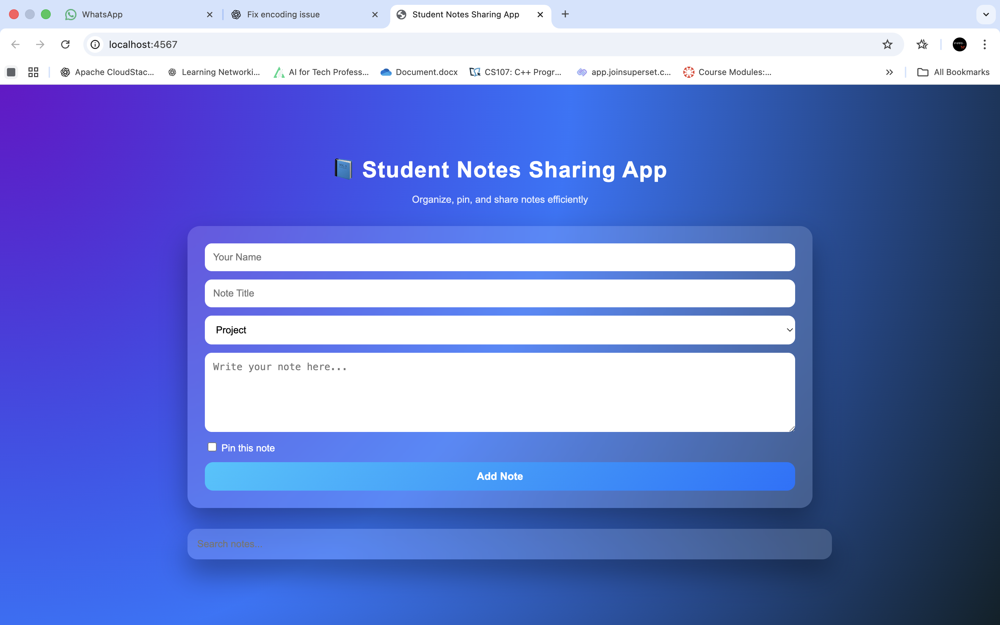
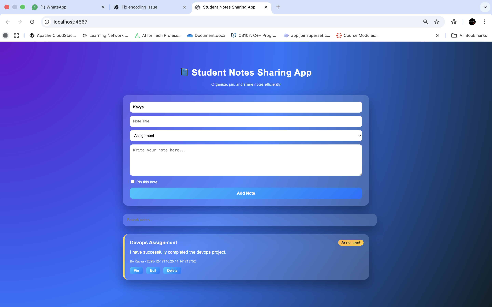
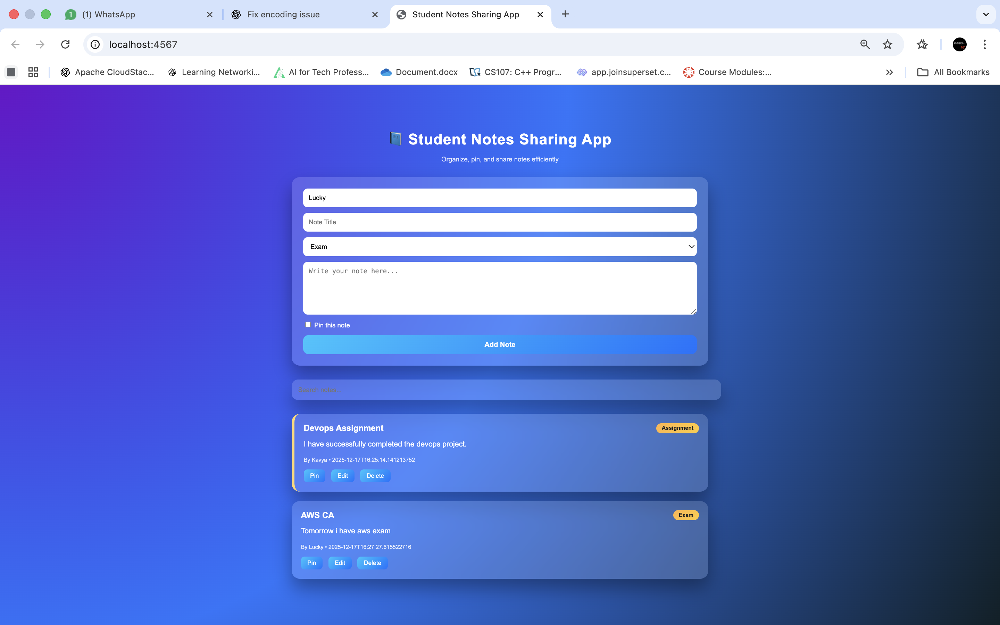
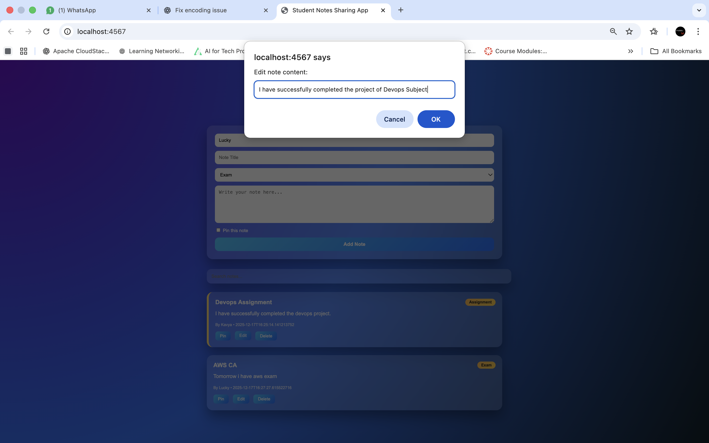
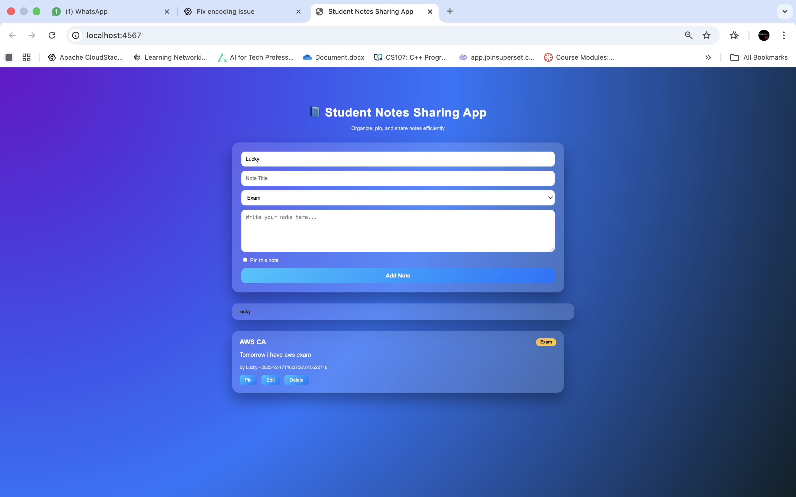

# Student Notes Sharing Application

## 📌 Project Description
The Student Notes Sharing Application is a web-based platform that allows students to create, view, search, pin, edit, and delete notes.  
The backend is developed using Java with Spark framework, while the frontend is built using HTML and CSS.  
Maven is used for dependency management and build automation.  
Docker is used to containerize the application for easy deployment and portability.  
Git and GitHub are used for version control and project management.

---

## 🛠 Technologies Used
- Java 17
- Spark Java Framework
- Maven
- HTML
- CSS
- Docker
- Git & GitHub

---

## 📂 Project Structure
student-notes-sharing/
├── src/main/java/NotesApp.java
├── src/main/resources/public/
│ ├── index.html
│ └── style.css
├── Dockerfile
├── .dockerignore
├── pom.xml
└── README.md


---

## 🚀 How to Run the Project Using Maven

### Build the Project
```bash
mvn clean package
### Run the Application
java -jar target/student-notes-sharing-1.0.jar
### Open in Browser
http://localhost:4567
### Build Docker Image
docker build -t student-notes-app .
### Run Docker Container
docker run -p 4567:4567 student-notes-app
### Access the Application
http://localhost:4567
🔧 Git and GitHub Operations Used
git init
git add .
git commit -m "Initial commit"
git branch
git checkout -b feature
git merge feature
git push origin main
git pull origin main
git clone <repository-url>
## Screenshots







